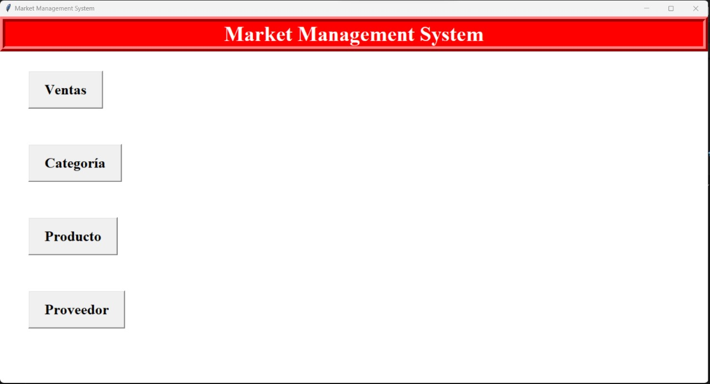
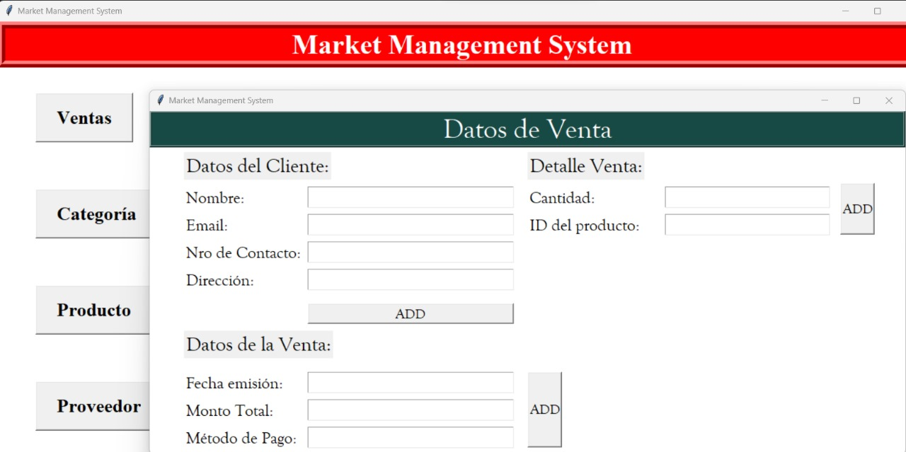
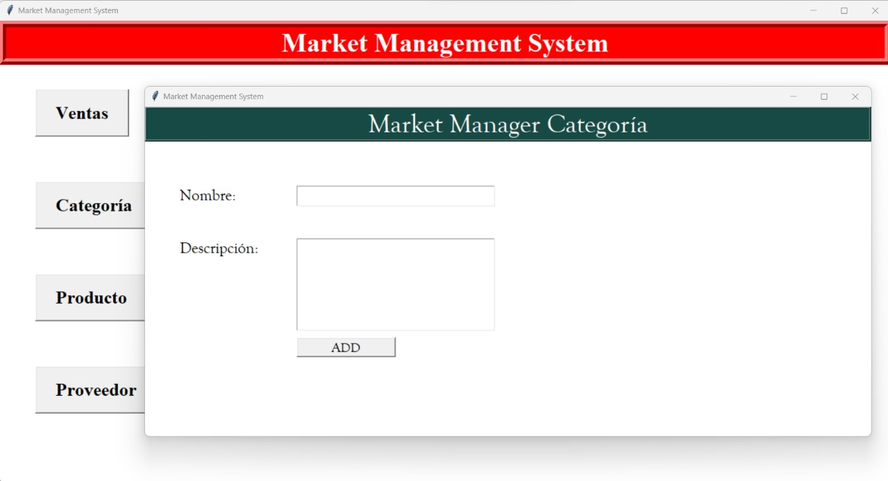
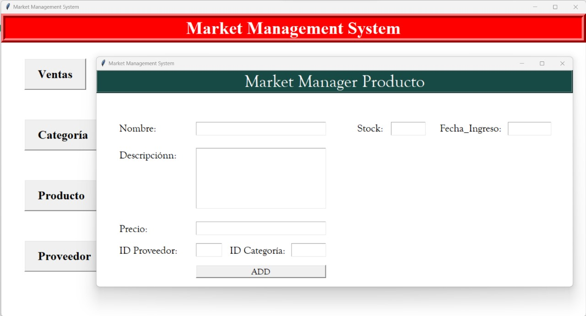
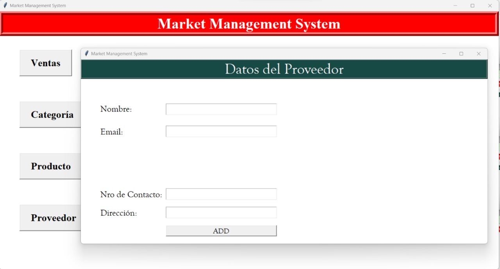

# Market Manager

## Descargo de Responsabilidad
Este proyecto aplica conceptos de programación y base de datos para fines educativos, utilizando Python y una base de datos Oracle. Se centra en la programación orientada a objetos y el formato snake_case para la base de datos.

## Introducción
Market Manager es un programa diseñado para facilitar la administración de una base de datos de supermercado. Permite la gestión eficiente de inventarios, clientes, proveedores y ventas, incluyendo la capacidad de realizar consultas, añadir productos, categorías, clientes y proveedores a la base de datos.

## Estructura de Base de Datos
- **Tabla Categoría:** Gestiona las categorías de productos.
- **Tabla Producto:** Almacena información de productos y se relaciona con las tablas `proveedor` y `categoría`.
- **Tabla Inventario:** Registra existencias de productos.
- **Tabla Persona:** Contiene información sobre individuos asociados al supermercado.
- **Tabla Proveedor y Cliente:** Define roles de personas como proveedores o clientes.
- **Tabla Nota_Venta y Detalle_Venta:** Maneja detalles de transacciones de venta.
- **Tabla Factura:** Almacena información de facturas generadas.

## Funciones del Programa
- Añadir nuevas categorías y productos.
- Gestión de personas y su asignación a clases específicas.
- Consultas a tablas específicas y de ventas recientes.

## Fases del Desarrollo
- Diseño del diagrama de clases.
- Configuración de la base de datos en Oracle.
- Conexión de la base de datos a Python.
- Diseño e implementación de la interfaz de usuario con Tkinter.

## Previsualización de la Interfaz

## Pseudocodigos
gui_app:
- Clase App:
    Función inicializar (root):
        Establecer título de root a "Market Management System"
        Establecer geometría de root a "1350x700+0+0"
        Configurar fondo de root a blanco
        Crear y ubicar botones para categoría, producto y proveedor

    Función category():
        Abrir nueva ventana para gestionar categorías

    Función product():
        Abrir nueva ventana para gestionar productos

    Función proveedor():
        Abrir nueva ventana para gestionar proveedores

Ventas:
Inicio

Importar módulos necesarios (Tkinter, supermercado_queries)

Definir clase ventasClass
    Inicializar la clase ventasClass
        Configurar la ventana principal
            - Título: "Market Management System"
            - Geometría: 1100x500, posicionada en (220, 130)
            - Color de fondo: blanco
            - Establecer foco en la ventana

        Definir variables (nombre, email, contacto, dirección, fecha, monto, método de pago)

        Crear y posicionar elementos de la interfaz
            - Título de la ventana
            - Etiquetas para datos del cliente (nombre, email, contacto, dirección)
            - Etiquetas para datos de la venta (fecha, monto, método de pago)
            - Campos de entrada para cada dato
            - Botón para agregar venta

        Definir función agregar_ventas
            - Crear objeto VentasDB con los datos ingresados
            - Llamar a la función agregar_ventas para almacenar los datos en la base de datos

Fin definición de clase ventasClass

Si el programa se ejecuta como principal
    Crear objeto Tk
    Crear objeto ventasClass con la ventana Tk
    Iniciar bucle principal de Tk

Fin

Categoria:
Inicio

Importar módulos necesarios (Tkinter, supermercado_queries)

Definir clase categoryClass
    Inicializar la clase categoryClass
        Configurar la ventana principal
            - Título: "Market Management System"
            - Geometría: 1100x500, posicionada en (220, 130)
            - Color de fondo: blanco
            - Establecer foco en la ventana

        Definir variables (nombre, descripción)

        Crear y posicionar elementos de la interfaz
            - Título de la ventana "Market Manager Categoría"
            - Etiquetas y campos de entrada para:
                - Nombre
                - Descripción
            - Botón para agregar categoría

        Definir función agregar_categoria
            - Crear objeto CategoriaDB con los datos ingresados
            - Llamar a la función agregar_cat para almacenar los datos en la base de datos

Fin definición de clase categoryClass

Si el programa se ejecuta como principal
    Crear objeto Tk
    Crear objeto categoryClass con la ventana Tk
    Iniciar bucle principal de Tk

Fin

Producto:
Inicio

Importar módulos necesarios (Tkinter, supermercado_queries)

Definir clase productClass
    Inicializar la clase productClass
        Configurar la ventana principal
            - Título: "Market Management System"
            - Geometría: 1100x500, posicionada en (220, 130)
            - Color de fondo: blanco
            - Establecer foco en la ventana

        Definir variables (nombre, descripción, precio, id categoría, id proveedor, stock, fecha de ingreso)

        Crear y posicionar elementos de la interfaz
            - Título de la ventana "Market Manager Producto"
            - Etiquetas y campos de entrada para:
                - Nombre
                - Descripción
                - Precio
                - ID Proveedor
                - ID Categoría
                - Stock
                - Fecha de Ingreso
            - Botón para agregar producto

        Definir función agregar_producto
            - Crear objeto ProductoDB con los datos ingresados
            - Llamar a la función agregar_producto para almacenar los datos en la base de datos

Fin definición de clase productClass

Si el programa se ejecuta como principal
    Crear objeto Tk
    Crear objeto productClass con la ventana Tk
    Iniciar bucle principal de Tk

Fin

Proveedor:
Inicio

Importar módulos necesarios (Tkinter, supermercado_queries)

Definir clase proveedorClass
    Inicializar la clase proveedorClass
        Configurar la ventana principal
            - Título: "Market Management System"
            - Geometría: 1100x500, posicionada en (220, 130)
            - Color de fondo: blanco
            - Establecer foco en la ventana

        Definir variables (nombre, email, contacto, dirección)

        Crear y posicionar elementos de la interfaz
            - Título de la ventana "Datos del Proveedor"
            - Etiquetas y campos de entrada para:
                - Nombre
                - Email
                - Número de Contacto
                - Dirección
            - Botón para agregar proveedor

        Definir función agregar_proveedor
            - Crear objeto PersonaDB con los datos ingresados
            - Llamar a la función agregar_persona para almacenar los datos en la base de datos

Fin definición de clase proveedorClass

Si el programa se ejecuta como principal
    Crear objeto Tk
    Crear objeto proveedorClass con la ventana Tk
    Iniciar bucle principal de Tk

Fin

## Uso:
Al ingresar desde la terminar, ejecutar app.py.

## Licencia
'OracleDB'
'Tkinter'
